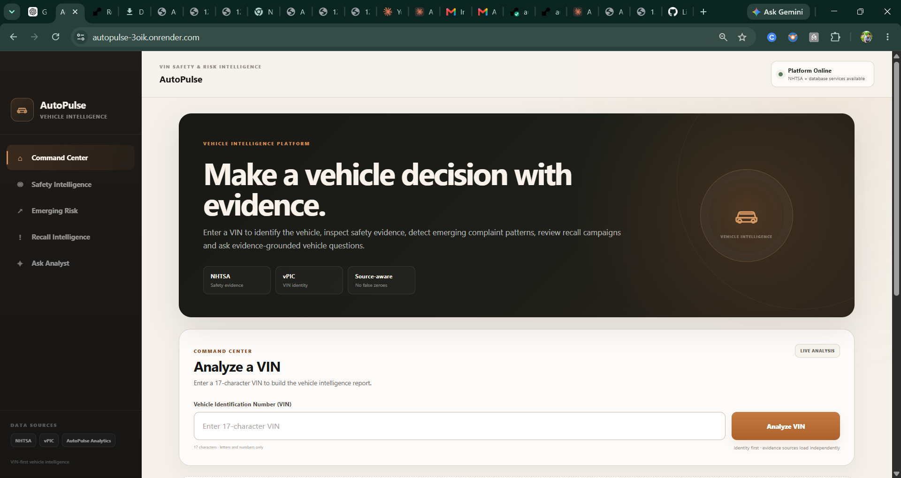

# AutoPulse

**VIN-first vehicle safety and risk intelligence**

AutoPulse is a production-style vehicle intelligence platform that turns a VIN into a structured, evidence-grounded safety report. It combines vehicle identity, complaints, recalls, safety ratings, trend signals, and AI-assisted explanation into one interface while preserving uncertainty when source data is incomplete.

**Live application:** https://autopulse-3oik.onrender.com

---

## Why I built it

Vehicle research is often fragmented. Recalls may live on one site, complaints on another, safety ratings somewhere else, and the user is left to connect the pieces.

AutoPulse was built to answer a more useful question:

> What does the available evidence actually say about this vehicle, and what is still unknown?

The platform is intentionally conservative. Missing evidence is not converted into a zero, and a composite risk signal can be withheld when the required evidence is unavailable.

---

## What AutoPulse does

- Decodes a VIN and establishes vehicle identity
- Retrieves and normalizes NHTSA vehicle information
- Surfaces real-world complaint evidence when available
- Summarizes recall activity
- Presents NCAP safety-rating evidence when available
- Detects emerging issue and trend signals
- Preserves unavailable or incomplete evidence explicitly
- Produces an evidence-aware vehicle risk view
- Provides an AI Analyst that explains the active vehicle report without inventing missing evidence

---

## Product experience

AutoPulse is organized around four primary intelligence views.

### Command Center
The main decision surface for the active VIN. It brings together vehicle identity, evidence status, risk logic, important issues, recalls, and source availability.

### Safety Intelligence
Focuses on available safety-related evidence, including complaints, crash-related signals, injury or fire context, and rating information.

### Emerging Risk
Highlights issue concentration and developing patterns using normalized complaint and vehicle-identity data.

### Recall Intelligence
Shows available recall campaigns and explains their relevance without assuming a model-year campaign automatically applies to the exact VIN.

### Ask Analyst
Lets the user ask natural-language questions about the current vehicle. The analyst is grounded in the evidence AutoPulse has already retrieved and is instructed to preserve data gaps rather than fill them with assumptions.

---

## Evidence-first design

A central rule in AutoPulse is:

**Unavailable data is not the same as zero.**

Examples:

- If complaint data cannot be retrieved, AutoPulse does not report `0 complaints`.
- If required evidence is missing, the composite risk score can be withheld.
- Model-year recall evidence is separated from VIN-specific recall confirmation.
- Partial evidence remains visibly marked as partial.

This makes the output more defensible and reduces false confidence.

---

## Screenshot



---

## Architecture

```text
Browser
  |
  v
FastAPI application
  |
  +-- Static frontend
  |     +-- HTML
  |     +-- CSS
  |     +-- JavaScript
  |
  +-- VIN / vehicle intelligence APIs
  |
  +-- AutoPulse analytics logic
  |
  +-- PostgreSQL
  |     +-- identity schema
  |     +-- operational schema
  |
  +-- NHTSA / VPIC data
  |
  +-- Anthropic API
        +-- evidence-grounded Ask Analyst
```

### Deployment

```text
GitHub
   |
   v
Render Web Service
   |
   +---- Render PostgreSQL
   |
   +---- External vehicle-safety APIs
   |
   +---- Anthropic API
```

---

## Technology stack

### Backend
- Python
- FastAPI
- Uvicorn
- Pydantic
- Requests
- Psycopg

### Database
- PostgreSQL
- Identity-resolution tables
- Operational analytics tables

### Frontend
- HTML
- CSS
- Vanilla JavaScript

### Data and analytics
- NHTSA VPIC
- NHTSA vehicle-safety data
- Vehicle identity normalization
- Recall intelligence
- Complaint analysis
- Explainable entity resolution
- Evidence-aware risk logic

### AI
- Anthropic API
- Evidence-grounded vehicle Q&A

### Deployment
- GitHub
- Render Web Service
- Render PostgreSQL

---

## Data model

The deployed PostgreSQL database separates the platform into two primary schemas.

### `identity`
Contains normalized vehicle identity and entity-resolution structures such as manufacturers, makes, models, vehicle types, aliases, and vehicle configurations.

### `operational`
Contains operational vehicle and service-analysis structures used by the application.

This separation keeps identity resolution independent from downstream analytical behavior.

---

## Entity resolution

Vehicle data from different sources is rarely standardized perfectly.

AutoPulse includes an explainable entity-resolution workflow that:

- normalizes make and model strings
- evaluates aliases
- generates candidate matches
- records matching logic
- preserves unresolved identities for review
- avoids silently forcing low-confidence matches

This matters because downstream complaint, recall, and trend analytics are only as reliable as the vehicle identity they are attached to.

---

## AI Analyst guardrails

The Ask Analyst feature is intentionally constrained.

It should:

- explain only the evidence associated with the active VIN report
- identify known evidence separately from unavailable evidence
- avoid treating missing complaints or ratings as zero
- avoid claiming a model-year recall definitely applies to the exact VIN unless VIN-specific confirmation exists
- explain why a risk signal is withheld when required evidence is missing

The goal is explanation, not invented certainty.

---

## Example behavior

For a vehicle with partial evidence, AutoPulse may return:

- vehicle identity: confirmed
- complaint evidence: unavailable
- recall campaign evidence: available
- NCAP evidence: unavailable
- risk score: withheld
- analyst response: explains the known evidence and explicitly identifies the remaining gaps

That behavior is intentional.

---

## Running locally

Clone the repository:

```bash
git clone https://github.com/LikhithYedida/autopulse.git
cd autopulse
```

Create and activate a virtual environment, then install dependencies:

```bash
pip install -r requirements.txt
```

Set the required environment variables:

```text
DATABASE_URL=<postgresql connection string>
ANTHROPIC_API_KEY=<your Anthropic API key>
```

Start the application:

```bash
uvicorn app.main:app --reload
```

Then open:

```text
http://127.0.0.1:8000
```

---

## Production deployment

The public application is deployed on Render.

Production components:

- FastAPI web service
- PostgreSQL database
- `/health` health-check endpoint
- environment-based database credentials
- server-side Anthropic API key
- automatic deployment from the GitHub `main` branch

---

## Current limitations

AutoPulse depends on external public data sources, so some vehicles may have incomplete evidence.

Known limitations include:

- source availability can vary by vehicle
- some safety-rating data may not exist for a specific model or model year
- complaint retrieval can be incomplete or temporarily unavailable
- recall campaign evidence does not always confirm VIN-specific applicability
- free hosting infrastructure can introduce cold-start latency
- the current hosted PostgreSQL instance is intended for portfolio/demo use

These limitations are surfaced in the product rather than hidden.

---

## Project principles

1. Evidence before scoring
2. Missing is not zero
3. Identity resolution must be explainable
4. Source gaps should remain visible
5. AI should explain retrieved evidence, not replace it
6. The interface should support a decision without pretending certainty

---

## Repository structure

```text
autopulse/
├── app/
│   ├── main.py
│   └── static/
│       ├── index.html
│       ├── app.js
│       └── css/
│           └── autopulse.css
├── config/
├── data/
├── docs/
│   └── screenshots/
│       └── homepage.png
├── models/
├── notebooks/
├── sql/
├── src/
├── tests/
├── requirements.txt
└── README.md
```

---

## Status

AutoPulse is live and currently supports:

- VIN-first analysis
- cloud PostgreSQL
- evidence-aware risk handling
- safety intelligence
- emerging-risk analysis
- recall intelligence
- AI Analyst
- public Render deployment

---

## Author

**Likhith Yedida**

Built as an end-to-end vehicle intelligence and analytics portfolio project.
